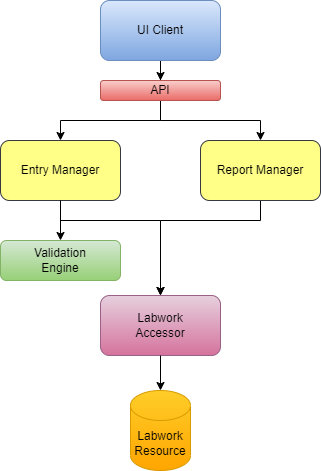
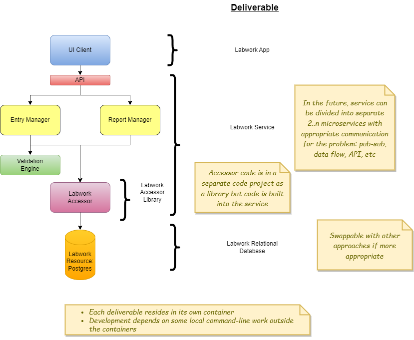

# Design

Using the IDesign methodology

## Conceptual Design

## Project Solution and Deliverable Approach

## Use Cases

1. User can enter labwork data
2. User can see labwork history visually
3. User can export the labwork data

## Architecture and Design

1. Clients
    - User app

2. Managers
    a. Entry Manager
        - POST endpoints to save labwork data
        - Includes a validation enginer
    b. Data Reporter Manager
        - GET endpoints to retrieve historical data

3. Accessors
    a. Save labwork
    b. Get individual lab marker
    c. Get labwork series

4. Resources TBD
    a. First option: SQL Server database
    b. Second option: Postgres

## Tech Stack

The user app is a standalone React SPA based on the Visual Studio 2022 template to expedite getting this demo up and running.

1. React
1. C#/.NET 8
1. Postgres